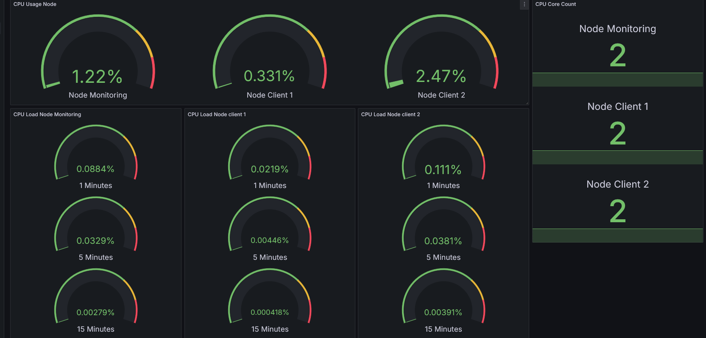
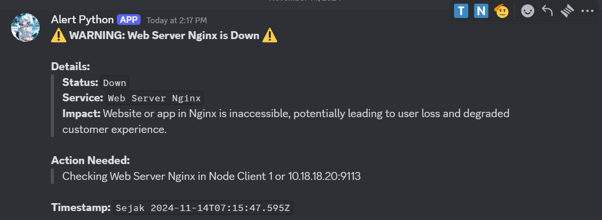
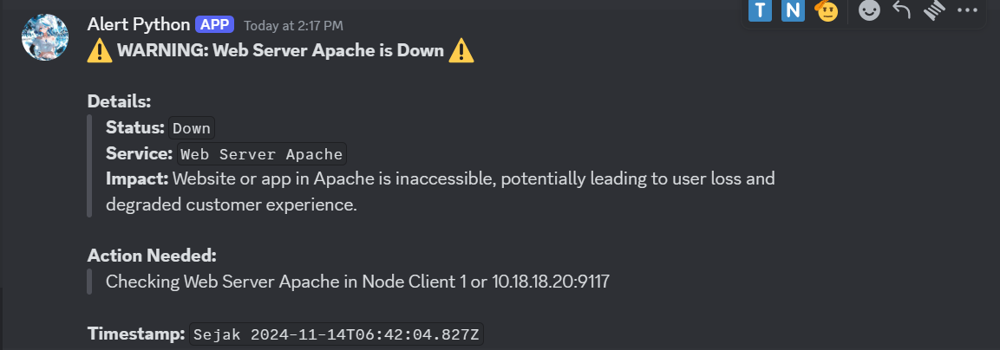
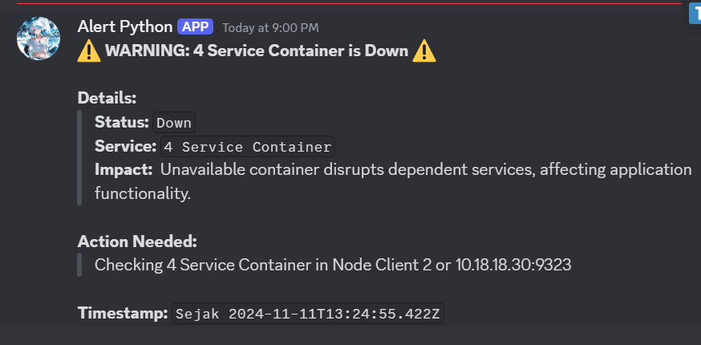
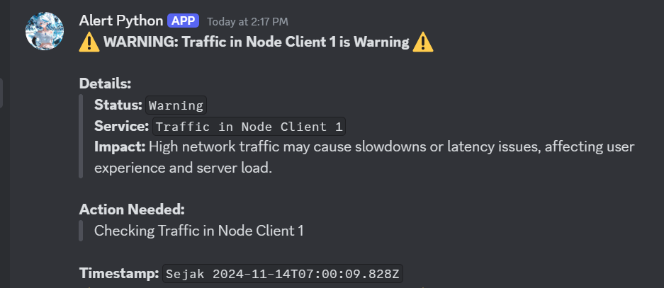

Di zaman modern sekarang yang serba otomatis serta kebutuhan akan monitoring atau pengecekan secara berkala, membuat kebutuhan akan tools automation monitoring yang canggih tanpa adanya campur tangan manusia untuk pengambilan data yang di monitoring tersebut, seperti penggunaan CPU, memory, disk atau traffic jaringan, menjadi semakin meningkat. Prometheus adalah salah satu solusi akan hal tersebut, yang menyediakan cara monitoring real time tanpa perlu adanya campur tangan manusia saat mengambil data yang harus di monitoring.

Dan dibutuhkan juga tools untuk visualisasi agar memudahkan dalam melakukan monitoring suatu system, aplikasi maupun server, Grafana disini berperan sebagai tools visualisasi yang sangat popular, karena kemampuannya dalam menangani visualisasi dengan banyak tools lain, sehingga lebih fleksible.

Serta dibutuhkan juga Alerting agar dapat memberikan peringatan dini terkait semisal adanya ganguan pada system yang menyebabkan system down, atau semisal ada terkait ancaman Cyber crime seprti DoS atau DDoS. Alert Manager Prometheus yang mengambil peran ini, yang nantinya akan mengirimkan peringatan apabila terjadi hal – hal tadi, sehingga meminimalisir terjadinya kerusakan pada system atau aplikasi kita. Alert Manager sendiri dapat di integrasikan dengan beberapa tools untuk notifikasi lain seperti Discord, Email atau WebHook Endpoint. Sehingga lebih fleksible dalam penggunaan alerting nya.

### Tools yang Digunakan

- **Prometheus – 2.48.1**
- **Grafana – 11.2.2**
- **Alert Manager – 0.26.0**
- **Node Exporter – 1.8.2**
- **Nginx – 1.10.0**
- **Nginx Exporter – 0.11.0**
- **Apache2 – 2.4.52**
- **Apache Exporter – 1.0.3**
- **Docker – 27.3.1**
- **cAdvisor**
- **Python – 3.10.12**
- **Discord**
- **Email**

<br>

### Topologi

.

<br>

### Alur kerja


<br>

#### Apache

&nbsp;&nbsp;&nbsp;&nbsp;&nbsp;&nbsp;&nbsp;&nbsp;Apache adalah salah satu software web server gratis dan open source, yang memungkinkan pengguna mengupload website nya ke internet. Apache sendiri sudah hampir menjadi platform website bagi kurang lebih 33% website di dunia, dengan nama resmi “Apache HTTP Server”. Apache pertama kali dirilis pada tahun 1995 dan dikelola oleh “Apache Software Foundation”.

#### Nginx

&nbsp;&nbsp;&nbsp;&nbsp;&nbsp;&nbsp;&nbsp;&nbsp;NGINX (Engine-X) adalah salah satu web server yang banyak digunakan untuk membuat suatu website, dan digunakan hampir 34% dari seluruh website yang ada di internet. Nginx memiliki daya tarik karena sifatnya sebagai server HTTP, Reverse proxy, dan load balancer.

#### Exporter Prometheus

&nbsp;&nbsp;&nbsp;&nbsp;&nbsp;&nbsp;&nbsp;&nbsp;Exporter Prometheus adalah suatu tools yang digunakan untuk mengubah data metrics dari suatu layanan aplikasi atau sistem yang tadinya tidak bisa di baca oleh Prometheus menjadi bisa di baca, bertindak sebagai perantara untuk layanan yang di pantau dengan Prometheus.

#### CAdvisor

&nbsp;&nbsp;&nbsp;&nbsp;&nbsp;&nbsp;&nbsp;&nbsp;Cadvisor (Container Advisor) adalah suatu tools yang digunakan untuk memonitoring atau memantau performa / kinerja dari suatu container, serta mengambil data metrics dari Container, seperti penggunaan CPU, Memory, Traffic jaringan atau Disk I/O dari setiap container yang ada.

#### SSL (Secure Sockets Layer)

&nbsp;&nbsp;&nbsp;&nbsp;&nbsp;&nbsp;&nbsp;&nbsp;SSL merupakan Protocol keamanan yang digunakan untuk mengenkrip si data seperti informasi pribadi, password, rekening, dan data lain yang bersifat sensitif, saat data dikirim kan ke server, data tersebut akan di enkripsi untuk menjaga keamanan dari data tersebut. SSL sertifikat yaitu sertifikat digital digunakan untuk autentikasi indentitas dari situs web yang memungkinkan koneksi enkripsi yang aman. Dan sering digunakan untuk menjaga keamanan data pengguna yang perlu memverifikasi kepemilikan situs website.

<br>

### Implementasi

#### 1. Konfigurasi SSL Certificate untuk layanan

- Buat file IP SAN untuk setiap Server / Node.
  ```bash
  ~$ sudo nano /etc/ssl/IP_SANS.txt
  ```
  ```bash
  subjectAltName=IP:<IP dari setiap Server / Node>
  ```
  
  ---
- Buat directory untuk menyimpan CA di dalam directory **_“/etc/ssl/”_** agar lebih rapi serta mudah di identifikasi.
  - Node Monitoring
    ```bash
    # Untuk Prometheus
    ~$ sudo mkdir -p /etc/ssl/prometheus
    ~$ sudo mkdir -p /etc/ssl/prometheus/cert/
    ~$ sudo mkdir -p /etc/ssl/prometheus/cert/<IP atau Domain dari Prometheus>/
    
    # Untuk Targets Prometheus
    ~$ sudo mkdir -p /etc/ssl/node_exporter/
    ~$ sudo mkdir -p /etc/ssl/apache_exporter/
    ~$ sudo mkdir -p /etc/ssl/nginx_exporter/
    ```
  
    ---
  - Node Client 1
    ```bash
    # Untuk Node Exporter
    ~$ sudo mkdir -p /etc/ssl/node_exporter/

    # Untuk Apache
    ~$ sudo mkdir -p /etc/ssl/apache/
    ~$ sudo mkdir -p /etc/ssl/apache/client/
    ~$ sudo mkdir -p /etc/ssl/nginx
    ```
  
    ---
  - Node Client 2
    ```bash
    # Untuk Node Exporter
    ~$ sudo mkdir -p /etc/ssl/node_exporter/
    ```
  
    ---
- Buat Certificate untuk beberapa layanan berikut :
  - Prometheus
    ```bash
    ~$ sudo openssl genrsa -out /etc/ssl/prometheus/cert/10.18.18.10:9090/10.18.18.10:9090.key 2048
    
    ~$ sudo openssl req -sha512 -new \
      -subj "/C=IN/ST=jateng/L=kendal/0=Prometheus Najwan/OU=Prometheus Najwan/CN=Prometheus Najwan>" \
      -key /etc/ssl/prometheus/cert/10.18.18.10:9090/10.18.18.10:9090.key \
      -out /etc/ssl/prometheus/cert/10.18.18.10:9090/10.18.18.10:9090.csr

    ~$ sudo openssl x509 -req -sha512 -days 3650 \
         -key /etc/ssl/prometheus/cert/10.18.18.10:9090/10.18.18.10:9090.key \
         -extfile /etc/ssl/IP_SANS.txt \
         -in /etc/ssl/prometheus/cert/10.18.18.10:9090/10.18.18.10:9090.csr\
         -out /etc/ssl/prometheus/cert/10.18.18.10:9090/10.18.18.10:9090.crt
    ```
  
    ---
  - Node Exporter
    ```bash
    ~$ sudo openssl genrsa -out /etc/ssl/node_exporter/node_exporter.key 2048
    
    ~$ sudo openssl req -sha512 -new \
        -subj "/C=IN/ST=jateng/L=kendal/0=Node Exporter Najwan/OU=Node Exporter Najwan/CN=Node Exporter Najwan>" \
        -key /etc/ssl/node_exporter/node_exporter.key \
        -out /etc/ssl/node_exporter/node_exporter.csr

    ~$ sudo openssl x509 -req -sha512 -days 3650 \
        -key /etc/ssl/node_exporter/node_exporte.key \
        -extfile /etc/ssl/IP_SANS.txt \
        -in /etc/ssl/node_exporter/node_exporte.csr\
        -out /etc/ssl/node_exporter/node_exporte.crt
    ```
  
    ---
  - Web Service Apache2 dan Apache Exporter
    ```bash
    ~$ sudo openssl genrsa -out /etc/ssl/apache/apache.key 2048
    
    ~$ sudo openssl req -sha512 -new \
        -subj "/C=IN/ST=jateng/L=kendal/0=Apache Najwan/OU=Apache Najwan/CN=Apache Najwan>" \
        -key /etc/ssl/apache/apache.key \
        -out /etc/ssl/apache/apache.csr

    ~$ sudo openssl x509 -req -sha512 -days 3650 \
        -key /etc/ssl/apache/apache.key \
        -extfile /etc/ssl/IP_SANS.txt \
        -in /etc/ssl/apache/apache.csr\
        -out /etc/ssl/apache/apache.crt
    ```
  
    ---
  - Client Web Server Apache2
    ```bash
    ~$ sudo openssl genrsa -out /etc/ssl/apache/client/client.key 2048
    
    ~$ sudo openssl req -sha512 -new \
        -subj "/C=IN/ST=jateng/L=kendal/0=Apache Najwan/OU=Apache Najwan/CN=Apache Najwan>" \
        -key /etc/ssl/apache/client/client.key \
        -out /etc/ssl/apache/client/client.csr

    ~$ sudo openssl x509 -req -sha512 -days 3650 \
        -key /etc/ssl/apache/client/client.key \
        -extfile /etc/ssl/IP_SANS.txt \
        -in /etc/ssl/apache/client/client.csr\
        -out /etc/ssl/apache/client/client.crt
    ```
  
    ---
  - Web Service Nginx dan Nginx Exporter
    ```bash
    ~$ sudo openssl genrsa -out /etc/ssl/nginx/nginx.key 2048
       
    ~$ sudo openssl req -sha512 -new \
        -subj "/C=IN/ST=jateng/L=kendal/0=Nginx Najwan/OU=Nginx Najwan/CN=Nginx Najwan>" \
        -key /etc/ssl/nginx/nginx.key \
        -out /etc/ssl/nginx/nginx.csr

    ~$ sudo openssl x509 -req -sha512 -days 3650 \
        -key /etc/ssl/nginx/nginx.key \
        -extfile /etc/ssl/IP_SANS.txt \
        -in /etc/ssl/nginx/nginx.csr\
        -out /etc/ssl/nginx/nginx.crt
    ```
  
    ---

<br>

#### 2. Install Node Exporter dan Konfigurasi SSL

- Install Package Node Exporter, lalu pindahkan ke directory **_"/etc"_**.
  ```bash
  ~$ wget https://github.com/prometheus/node_exporter/releases/download/v1.8.2/node_exporter-1.8.2.linux-amd64.tar.gz
  ~$ sudo cp node_exporter-1.8.2.linux-amd64 /etc/node_exporter/
  ```

  ---
- Buat file **_“config.yml”_** di directory **_“/etc/node_exporter”_** yang nantinya digunakan untuk koneksi ssl.
  ```yaml
  tls_server_config:
    cert_file: /etc/ssl/node_exporter/node_exporter.crt
    key_file: /etc/ssl/node_exporter/node_exporter.key
  ```

  ---
- Buat service, agar dapat berjalan di background.
  ```bash
  ~$ sudo /etc/systemd/system/node-exporter.service

  [Unit]
  Description=Node Exporter
  [Service]
  User=root
  ExecStart=/etc/node_exporter/node_exporter \
      --web.config.file="/etc/node_exporter/config.yml"

  [Install]
  WantedBy=default.target
  ```

  ---
- Restart Daemon dan jalankan service Node Exporternya.
  ```bash
  ~$ sudo systemctl daemon-reload
  ~$ sudo systemctl start node-exporter.service
  ~$ sudo systemctl enable node-exporter.service
  ~$ sudo systemctl status node-exporter.service
  ```

  ---

<br>

#### 3. Install dan Konfigurasi Apache dengan SSL

- Install Package Apache2, dan Download Source Code untuk aplikasi **_[2048](https://github.com/gabrielecirulli/2048)_**.
  ```bash
  ~$ sudo apt install apache2 -y
  ~$ git clone https://github.com/gabrielecirulli/2048
  ~$ sudo cp 2048 /var/www/html/
  ```

  ---
- Konfigurasi untuk mods SSL di Apache.
  ```bash
  ~$ sudo nano /etc/apache2/mods-available/ssl.conf
  ```

  ```apache
  ---
  SSLProtocol all -SSLv3 -TLSv1 -TLSv1.1 +TLSv1.2 +TLSv1.3
  ---
  ```

  ```bash
  ~$ sudo a2enmod ssl
  ```

  ---
- Konfigurasi untuk web nya agar menampikan aplikasi yang sesuai.
  ```bash
  ~$ sudo nano /etc/apache2/sites-available/default-ssl.conf
  ```

  ```apache
  <VirtualHost_default_:443>
      ServerName 10.18.18.20
      DocumentRoot /var/www/html/2048
      SSLEngine on
      SSLCertificateFile      /etc/ssl/apache/apache.crt
      SSLCertificateKeyFile   /etc/ssl/apache/apache.key
      SSLCACertificateFile    /etc/ssl/apache/client/client.crt
      
      <Location "/server-status">
          SetHandler server-status
      </Location>
  ---
  ```

  ```bash
  ~$ sudo a2ensite default-ssl.conf
  ```

  ---
- Restart layanan Apache2.
  ```bash
  ~$ udo systemctl restart apache2.service
  ~$ udo systemctl status apache2.service
  ```

  ---

<br>

#### 4. Install dan Konfigurasi Nginx dengan SSL

- Install Package Apache2, dan Download Source Code untuk aplikasi **_[Tic Tac Toe](https://github.com/Aklilu-Mandefro/javascript-Tic-Tac-Toe-game-app)_**.
  ```bash
  ~$ sudo apt install nginx -y
  ~$ git clone https://github.com/Aklilu-Mandefro/javascript-Tic-Tac-Toe-game-app)
  ~$ sudo cp javascript-Tic-Tac-Toe-game-app /var/www/html/
  ```

  ---
- Konfigurasi untuk web nya agar menampikan aplikasi yang sesuai.
  ```bash
  ~$ sudo nano /etc/nginx/sites-available/default
  ```

  ```nginx
  server {
    listen 443 ssl default_server;
    listen [::]: 443 ssl default_server;
    
    root /var/www/html/javascript-Tic-Tac-Toe-game-app/;
    index index.html;
    ssl_certificate      /etc/ssl/nginx/nginx.crt;
    ssl_certificate_key  /etc/ssl/nginx/nginx.key;
    ssl_protocols        TLSv1 TLSv1.1 TLSv1.2 TLSv1.3;
    ssl_ciphers          HIGH:!aNULL:!MD5;

    location / {
          try_files $uri $uri/ =404;
    }
  
    location = /server-status {
          stub_status on;
    }
  }
  ```
  
  ---
- Restart layanan Nginx.
  ```bash
  ~$ sudo systemctl restart nginx.service
  ~$ sudo systemctl status nginx.service
  ```

  ---

<br>

#### 5. Install Apache Exporter dengan SSL

- Download Package Apache Exporter, lalu pindahkan ke directory **_"/etc"_**.
  ```bash
  ~$ wget https://github.com/Lusitaniae/apache_exporter/releases/download/v1.0.3/apache_exporter-1.0.3.linux-amd64.tar.gz
  ~$ tar xvzf apache_exporter-1.0.3.linux-amd64.tar.gz
  ~$ sudo cp apache_exporter-1.0.3.linux-amd64 /etc/apache_exporter
  ```
  
  ---
- Buat file **_“config.yml”_** di directory **_“/etc/apache_exporter”_** yang nantinya digunakan untuk koneksi ssl.
  ```yaml
  tls_server_config:
     cert_file: /etc/ssl/apache_exporter/apache_exporter.crt
     key_file: /etc/ssl/apache_exporter/apache_exporter.key
  ```

  ---
- Buat service, agar dapat berjalan di background.
  ```bash
  ~$ sudo /etc/systemd/system/apache-exporter.service
  ```

  ```bash
  [Unit]
  Description=Apache Exporter
  [Service]
  User=root
  ExecStart=/etc/apache_exporter/apache_exporter \
       --scrape_url="https://{IP_SERVER_APACHE}:443/server-status?auto" \
       --web.config.file="/etc/apache_exporter/config.yml" \
       --insecure
  
  [Install]
  WantedBy=default.target
  ```
  
- Restart Daemon dan jalankan service Node Exporternya.
  ```bash
  ~$ sudo systemctl daemon-reload
  ~$ sudo systemctl start node-exporter.service
  ~$ sudo systemctl enable node-exporter.service
  ~$ sudo systemctl status node-exporter.service
  ```

  ---

<br>

#### 6. Install Nginx Exporter dengan SSL

- Install Package Nginx Exporter, lalu pindahkan ke directory **_"/etc"_**.
 ```bash
  ~$ wget https://github.com/nginxinc/nginx-prometheus-exporter/releases/download/v0.11.0/nginx-prometheus-exporter_0.11.0_linux_amd64.tar.gz
  ~$ tar -xvzf nginx-prometheus-exporter_0.11.0_linux_amd64.tar.gz
  ~$ sudo cp nginx-prometheus-exporter_0.11.0_linux_amd64 /etc/nginx_exporter
  ```
  
  ---
- Buat file **_“config.yml”_** di directory **_“/etc/nginx_exporter”_** yang nantinya digunakan untuk koneksi ssl.
  ```yaml
  tls_server_config:
     cert_file: /etc/ssl/nginx_exporter/nginx_exporter.crt
     key_file: /etc/ssl/nginx_exporter/nginx_exporter.key
  ```
  
  ---
- Buat service, agar dapat berjalan di background.
  ```bash
  ~$ sudo /etc/systemd/system/nginx-exporter.service
  ```
  ```bash
  [Unit]
  Description=Nginx Exporter
  Wants=network-online.target
  After=network-online.target
   
  [Service]
  User=root
  ExecStart=/etc/nginx_exporter/nginx-prometheus-exporter \
       -nginx.scrape-uri=https://{IP_SERVER_NGINX}:443/server-status
       -nginx.ssl-ca-cert="/etc/ssl/nginx/nginx.crt" \
       -web.secured-metrics=true \
       -web.ssl-server-cert="/etc/ssl/nginx/nginx.crt" \
       -web.ssl-server-key="/etc/ssl/nginx/nginx.key"
  
  [Install]
  WantedBy=default.target
  ```

  ---
- Restart Daemon dan jalankan service Nginx Exporternya.
  ```bash
  ~$ sudo systemctl daemon-reload
  ~$ sudo systemctl start nginx-exporter.service
  ~$ sudo systemctl enable nginx-exporter.service
  ~$ sudo systemctl status nginx-exporter.service
  ```

  ---

<br>

#### 7. Install Docker
Panduan Dibawah ini mencakup langkah-langkah konfigurasi Docker di sistem yang akan dibutuhkan, sehingga Anda dapat dengan mudah memahami dan mengimplementasikannya. Untuk dependensi yang dibutuhkan ada pada list berikut.
```
docker-ce                # Package utama Docker
docker-ce-cli            # Package untuk CLI Docker
containerd.io            # Package untuk Container RunTime Docker
docker-buildx-plugin     # Package untuk Membuat Image Docker
docker-compose-plugin    # Package untuk Docker compose
```
Langkah Installasi lebih detail bisa kunjungi post saya yang **_[Install Docker](https://vianaja.github.io/blog-najwan/2024-10-01-install-docker/)_**.

<br>

#### 8. Install CAdvisor untuk Monitoring Container Docker

- Jalankan Container CAdvisor.
  ```bash
  ~$ docker run -d \
      --volume=/:/rootfs:ro \
      --volume=/var/run:/var/run:ro \
      --volume=/sys:/sys:ro \
      --volume=/var/lib/docker/:/var/lib/docker:ro \
      --volume=/dev/disk/:/dev/disk:ro \
      --publish=8080:8080 \
      --detach=true \
      --name=cadvisor\
      gcr.io/cadvisor/cadvisor:latest
  
  ~$ docker ps -a
  ```

  ---
  
<br>

#### 9. Install dan Konfigurasi Prometheus dengan SSL

- Untuk langkah - langkah Installasi Prometheus bisa mengikuti dari postingan saya yang  **_[Prometheus](https://vianaja.github.io/blog-najwan/2024-11-01-prometheus/)_**. Dan dilanjutkan dengan konfigurasi di bwah ini untuk menambahkan TLS ke Prometheusnya.
- Buat file **_“web-config.yml”_** di directory **_“/etc/prometheus/”_**  yang nantinya digunakan untuk koneksi ssl.
  ```yaml
  tls_server_config:
    cert_file: /path/to/prometheus_ca.crt
    key_file: /path/to/prometheus_ca.key
  ```

  ---
- Lalu edit di bagian Service, di bagian **_ExecStart_**. terus tambahkan untuk path dari file config untuk TLS/SSL dengan **_"--web.config.file"_**.
  ```bash
  ~$ sudo nano /etc/systemd/system/prometheus_server.service
  ```
  ```bash
  ---
  User=root
  ExecStart=/etc/prometheus/prometheus \
      --config.file=/etc/prometheus/config.yml \
      --web.external-url=https://10.18.18.10:9090/ \
      --web.config.file=/etc/prometheus/web-config.yml
  ---
  ```

  ---
- Edit di file **_/etc/prometheus/config.yml_** untuk Mengatur alerting ke AlertManager, Rules untuk Alerting, serta Targets yang akan di Pantau, dan konfigurasi untuk koneksi TLS/SSL nya juga. contohnya seperti berikut, saya monitoring untuk:
  - **3 Node Server (menggunakan Node Exporter)**
  - **Web Service (Apache2 dan Nginx)**
  - **Container Docker**
  
  ```yaml
  global:
    scrape_interval: 15s
    evaluation_interval: 15s
  
  alerting:
    alertmanagers:
      - static_configs:
          - targets:
            - 10.18.18.10:9093
  
  rule_files:
    - "rules-web-server.yml"
    - "rules-container.yml"
    - "rules-node.yml"
  
  scrape_configs:
    - job_name: "prometheus"
      scheme: https
      tls_config:
        ca_file: "/etc/prometheus/certs/10.18.18.10:9090/10.18.18.10:9090.crt"
      static_configs:
      - targets: ["10.18.18.10:9090"]
    
    - job_name: 'apache-exporter-client01'
      scheme: https
      tls_config:
        ca_file: "/etc/prometheus/apache/apache.crt"
      static_configs:
      - targets: ['10.18.18.20:9117']
    
    - job_name: 'nginx-exporter-client01'
      scheme: https
      tls_config:
        ca_file: "/etc/prometheus/nginx/nginx.crt"
        insecure_skip_verify: true
      static_configs:
      - targets: ['10.18.18.20:9113']
    
    - job_name: 'node monitoring'
      scheme: https
      tls_config:
        ca_file: "/etc/prometheus/node_exporter/node_exporter_monitoring.crt"
      static_configs:
      - targets: ['10.18.18.10:9100']
    
    - job_name: 'node client01'
      scheme: https
      tls_config:
        ca_file: "/etc/prometheus/node_exporter/node_exporter_client01.crt"
      static_configs:
      - targets: ['10.18.18.20:9100']
    
    - job_name: 'node client02'
      scheme: https
      tls_config:
        ca_file: "/etc/prometheus/node_exporter/node_exporter_client02.crt"
      static_configs:
      - targets: ['10.18.18.30:9100']
    
    - job_name: 'docker-node-client02'
      static_configs:
      - targets: ['10.18.18.30:9323']
    
    - job_name: 'cAdvisor-client02'
      static_configs:
      - targets: ['10.18.18.30:8080']
  ```
 
  ---

<br>

#### 10. Install Grafana

Bisa ikuti panduan Dibahwah ini mencakup langkah-langkah Installasi, konfigurasi Grafana hingga cara menambahkan Data Source, baik yang menggunakan HTTPS atau HTTP biasa. sehingga Anda dapat dengan mudah memahami dan mengimplementasikannya. Kunjungi Postingan saya yang ini [Grafana](https://vianaja.github.io/blog-najwan/2024-10-30-grafana/).

<br>

#### 11. Install Alert Manager

Untuk langkah - langkah Installasi Alert Manager bisa mengikuti dari Postingan saya yang ini. [Alert Manager](https://vianaja.github.io/blog-najwan/2024-11-02-alert-manager/). Sudah mencakup penjelasan juga agar lebih memahami terkait Alert Manager, lalu untuk Project yang saya buat, perlu ada konfigurasi tambahan lagi, mengikuti instruksi di bawah ini.

- Konfigurasi untuk Alert Managernya untuk mengirim notifikasi ke mana, sebagai contoh di sini saya menggunakan 3, yaitu ke Email, Discord Webhook dan Endpoint Webhook URL (yang nantinya saya hubungkan ke Program Python yang akan memfilter Notification yang di kirim).
  ```yaml
  global:
    resolve_timeout: 15s
  
  route:
    receiver: discord-all
    routes:
    - receiver: discord-python
      continue: true
    - receiver: email
  
  receivers:
  # Integrasi ke Email
  - name: email
    email_configs:
    - to: "email@test.id"
      from: "email@test.id"
      smarthost: smtp.gmail.com:587
      auth_username: "email@test.id"
      auth_identity: "email@test.id"
      auth_password: "TOKEN_EMAIL"
      send_resolved: True

  # Integrasi ke Webhook Discord
  - name: discord-all
    discord_configs:
    - webhook_url: 'URL_WEBHOOKS_DISCORD'
  
  # Integrasi ke Program Python
  - name: discord-python
    webhook_configs:
    - url: "URL_ENDPOINT_PYTHON"
  ```
  
  ---
- Konfigurasi untuk rules yang mentrigger alert manager mengirim notifikasi.
  - Rules untuk Web Server Apache atau Nginx yang Down.

    ```yaml
    groups:
    - name: nginx.rules
      rules:
      - alert: nginxDown
        expr: nginx_up == 0
        for: 1m
        annotations:
          summary: "Service Nginx Down"
          description: "Service Nginx been down, sudah 1 menit, silahkan di cek dulu."
      
    - name: apache.rules
      rules:
      - alert: apacheDown
        expr: apache_up == 0
        for: 1m
        annotations:
          summary: "Service Apache Down"
          description: "Service Apache been down, sudah 1 menit, silahkan di cek dulu."
    ```
  
    ---
  - Rules untuk jumlah Container yang Stopped atau Down.

    ```yaml
    groups:
    - name: container.rules
      rules:
      - alert: containerDown
        expr: engine_daemon_container_states_containers{state="stopped"} > 0
        for: 1m
        labels:
          valueService: "{{ $value }}"
        annotations:
          summary: "{{ $value }} Service container Down"
          description: "{{ $value }} Service container Down, sudah 1 menit, silahkan di cek dulu"
    ```
  
    ---
  - Rules untuk CPU Available pada semua server atau node.

    ```yaml
    groups:
    - name: cpu-free-under-35-monitoring.rules
      rules:
      - alert: cpu-free-under-35-monitoring
        expr: (sum by(mode) (rate(node_cpu_seconds_total{job=~"node monitoring", mode='idle'}[1h])) / 2) * 100 < 35
        for: 5s
        labels:
          nodeName: "Node Monitoring"
          cpuUsage: "{{ $value }}"
    
    - name: cpu-free-under-35-client01.rules
      rules:
      - alert: cpu-free-under-35-client01
        expr: (sum by(mode) (rate(node_cpu_seconds_total{job=~"node client01", mode='idle'}[1h])) / 2) * 100 < 35
        for: 5s
        labels:
          nodeName: "Node Client 1"
          cpuUsage: "{{ $value }}"

    - name: cpu-free-under-35-client02.rules
      rules:
      - alert: cpu-free-under-35-client02
        expr: (sum by(mode) (rate(node_cpu_seconds_total{job=~"node client02" mode='idle'}[1h])) / 2) * 100 < 35
        for: 5s
        labels:
          nodeName: "Node Client 2"
          cpuUsage: "{{ $value }}"
    ```

    ---
  - Rules untuk Memory Available pada semua server atau node.

    ```yaml
    groups:
    - name: memory-available-under-35-Monitoring.rules
      rules:
      - alert: memory-available-under-35-Monitoring
        expr: (node_memory_MemAvailable_bytes{job="node monitoring"} / node_memory_MemTotal_bytes{job="node monitoring"}) * 100 < 35
        for: 5s
        labels:
          nodeName: "Node Monitoring"
          memUsage: "{{ $value }}"
    
    - name: memory-available-under-35-client01.rules
      rules:
      - alert: memory-available-under-35-client01
        expr: (node_memory_MemAvailable_bytes{job="node client01"} / node_memory_MemTotal_bytes{job="node client01"}) * 100 < 35
        for: 5s
        labels:
          nodeName: "Node Client 1"
          memUsage: "{{ $value }}"
    
    - name: memory-available-under-35-client02.rules
      rules:
      - alert: memory-available-under-35-client02
        expr: (node_memory_MemAvailable_bytes{job="node client02"} / node_memory_MemTotal_bytes{job="node client02"}) * 100 < 35
        for: 5s
        labels:
          nodeName: "Node Client 2"
          memUsage: "{{ $value }}"
    ```
  
    ---
  - Rules untuk Penyimpanan atau Disk jika penuh dari setiap server atau node.

    ```yaml
    groups:
    - name: disk-usage-75-persen-node-monitoring.rules
      rules:
      - alert: disk-usage-75-persen-node-monitoring
        expr: ((1 - (sum(node_filesystem_avail_bytes{instance="10.18.18.10:9100"})) / sum(node_filesystem_size_bytes{instance="10.18.18.10:9100"})) * 100) > 75
        for: 5s
        labels:
          nodeName: "Node Monitoring"
          diskUsage: "{{ $value }}"
    
    - name: disk-usage-75-persen-node-client01.rules
      rules:
      - alert: disk-usage-75-persen-node-client01
        expr: ((1 - (sum(node_filesystem_avail_bytes{instance="10.18.18.20:9100"})) / sum(node_filesystem_size_bytes{instance="10.18.18.20:9100"})) * 100) > 75
        for: 5s
        labels:
          nodeName: "Node Client 1"
          diskUsage: "{{ $value }}"
    
    - name: disk-usage-75-persen-node-client02.rules
      rules:
      - alert: disk-usage-75-persen-node-client02
        expr: ((1 - (sum(node_filesystem_avail_bytes{instance="10.18.18.30:9100"})) / sum(node_filesystem_size_bytes{instance="10.18.18.30:9100"})) * 100) > 75
        for: 5s
        labels:
          nodeName: "Node Client 2"
          diskUsage: "{{ $value }}"
    ```
  
    ---
  - Rules untuk Traffic Networking jika ada lonjakan Traffic dari setiap server atau node.

    ```yaml
    groups:
    - name: record-traffic-node-monitoring
      rules:
      - record: job:node_network_receive_total_monitoring:rate50s
        expr: rate(node_network_receive_bytes_total{job="node monitoring", device="lo"}[50s]) / (1024*1024)
    
    - name: traffic-monitoring.rules
      rules:
      - alert: traffic-monitoring
        expr: job:node_network_receive_total_monitoring:rate50s > 3     for: 0s
        labels:
          nodeName: "Node Monitoring"
          trafficUsage: "{{ $value }}"
    
    - name: record-traffic-node-client01
      rules:
      - record: job:node_network_receive_total_client01:rate50s
        expr: rate(node_network_receive_bytes_total{job="node client01", device="lo"}[50s]) / (1024*1024)
    
    - name: traffic-client01.rules
      rules:
      - alert: traffic-client01
        expr: job:node_network_receive_total_client01:rate50s > 3 
        for: 0s
        labels:
          nodeName: "Node Client 1"
          trafficUsage: "{{ $value }}"
    
    - name: record-traffic-node-client02
      rules:
      - record: job:node_network_receive_total_client02:rate50s
        expr: rate(node_network_receive_bytes_total{job="node client02", device="lo"}[50s]) / (1024*1024)
    
    - name: traffic-client02.rules
      rules:
      - alert: traffic-client02
        expr: job:node_network_receive_total_client02:rate50s > 3 
        for: 0s
        labels:
          nodeName: "Node Client 2"
          trafficUsage: "{{}}{{ $value }}}}"
    ```
  
    ---

<br>

#### 12. Menambahkan Program Python, agar filter Notifikasi ke Discord

- Ambil Token Discord agar program python nya dapat mengirim notifikasi ke channe Discorrd yang sesuai, dari referensi video **_[YouTube](https://youtu.be/UYJDKSah-Ww?si=2SYaHg74DT47RuGS)_** ini (cukup sampai pengambilan Token Discord).
    
- Donwload contoh sample program python di github **_[ini](https://github.com/vianAja/Discord-alertmanager-python.git)_**. untuk contoh filtering alert agar mengarah ke beberapa channel seperti di contoh. ikuti instruksi sesuai di githubnya.

<br>

### Sample Visualisasi dan Dashboard

#### A. Monitoring Node / Server

- Up Time Node / Server
  

  ---
  
- Disk
  

  ---
  
- Memory
  

  ---
  
- CPU
  

  ---
  
- Traffic
  

  ---
  
<br>

#### B. Monitoring Container

- Container Status
  

  ---
  
- CPU Container
  

  ---
  
<br>

#### C. Monitoring Web Server

- Stats Web Server
  

  ---
  
- Total Requests Web Server
  

  ---
  
### Web Server Aplikasi Tic Tac Toe


  ---
  
### Web Server Aplikasi 2048


  ---
  
### Alert Nginx



  ---
  
### Alert Apache



  ---
  
### Alert Container



  ---
  
### Alert Traffic



  ---
  